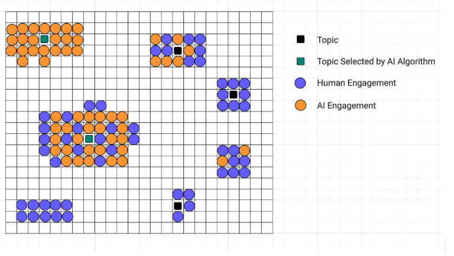

# **The Trend Manipulator: AI Driving Trends on X**

**Ebrahim AZARBAR, Emir CETINALP, Atmiya JADVANI**  
Team 14 \- EECS 4461 Winter 2025

GitHub Repository:

 [*https://github.com/atmiya0/EECS4461\_Team14\_Project.git*](https://github.com/atmiya0/EECS4461_Team14_Project.git)

# **Section 1: Phenomena of interest**

Social media platforms use algorithms to highlight and amplify the outreach of trending topics. AI-driven bots can manipulate these trends by artificially increasing engagement on posts to have higher chances of being picked up by the algorithm. This phenomenon is called metric manipulation where it is primarily found on social media platforms. For this study, we will be focused on a centralized social networking app like **Twitter (now X)**. X employs a sophisticated algorithm which utilizes AI to find the most relevant topics that are gaining attraction and are most relevant to you. As opposed to a decentralized social networking platform like Bluesky, where your data is stored in a personal data server (PDS) and you create your own custom feed. To combat social bots, X has employed various methods. X restricts accounts that repost, quote and like a lot daily and send captcha to suspicious users to confirm human validity. Nonetheless, these methods have not been successful and social bots are still rampant on X. Our justification for this topic is because as social media grows in popularity, it is important to distinguish an amplified fake news pushed by the algorithm as it affects our life. To relate it to our course, metric manipulation could be seen as a social determinism mechanism. This is clear when a consumer behavior is influenced by the popularity of a technology. As such, the artificially inflated topic can determine the use of that technology.

The key dynamic of the social bots can include mass-like posts, repost content, and interact with hashtags to boost or suppress specific narratives of one’s choosing. This could spread misinformation, manipulate public opinion, and can artificially inflate an individual's platform. Additionally, bots can also mass-report posts and accounts to push them out of the algorithm. Moreover, it is important to note that both AI-Human and AI-AI interactions will occur. Examples of this could be as the following: 

* **AI-Human Interaction:**   
  * Humans engage with X topics. X AI algorithm monitors it to decide its popularity and relevance to allow reaching a broader audience.  
* **AI-AI Interaction:**   
  * Clusters of social bots create artificial engagement with a certain post that then gets picked up by X AI algorithm to promote to others.

##### **Section 2: Relevant Works**

The 2 Articles that explore our phenomena of interest would be the following: (*changed both of our previous articles)*

Barhate et al \[1\] conducted a study on twitter revolving around spreading disinformation as well as hashtag manipulation. The results from this experiment showed that bots do have the ability to inflate a hashtag by increasing tweet volume on the topic. This ultimately would increase the perceived traffic of the hashtag, which in turn would artificially manipulate what hashtags were trending. The article also went over how platforms like twitter can detect bots where bot activity is concentrated, as well as key characteristics of bot accounts. The key takeaway from the study was that bots do have the ability to spread malicious content on the platform. 

Weng and Lin \[2\] focused on the role of social bots on twitter during the Covid 19 pandemic and how they are able to spread unverified information as well as conspiracy theories. The study also went over the key characteristics of how bots act as well as the methodologies that bots employ to have meaningful interactions that reach high traffic. Humans have direct influence on information, while social bots have indirect influence on information networks. The results of the study found that a good portion of the users (about 29%) interacting with the considering theories on twitter were bots. 

1. Barhate, S., Mangla, R., Panjwani, D., Gatkal, S., & Kazi, F. (2020). Twitter bot detection and their influence in hashtag manipulation. *2020 IEEE 17th India Council International Conference*, 1-7. https://doi.org/10.1109/INDICON49873.2020.9342152  
2. Weng, Z., & Lin, A. (2022). Public opinion manipulation on social media: Social network analysis of twitter bots during the COVID-19 pandemic. *Int J Environ Res Public Health*, 19(24). https://doi.org/10.3390/ijerph192416376

# **Section 3: Describe the Core Components of the Simulation**

The mesa example that most closely resembles our phenomena of interest is Epstein Civil Violence Model.

## **3.1 Entities:**

The bot type in our phenomena is a synthetic echo bot. The role of these bots is to amplify a topic on twitter. Where their goal is to give visibility to other users and manipulate social metrics to get picked up by X’s algorithm. They behave by liking, reposting, and engaging with contents individually or it can be coordinated across multiple bots. Similarly to the  Epstein civil violence model, the citizens observe other citizens' behaviour which has the potential to serve as a catalyst for more engagement.

In our phenomena of interest, our humans are twitter users that engage with social media content with the goal of organically interacting with X posts. When the topic has gained attraction and visibility, then human behaviours indicate that they are more inclined to engage with that trend. Human behaviour and the Epstein civil violence model for citizens behavior are similar where if enough citizens are rebelling, then it makes citizens more likely to join the uprising.

## **3.2 Affordances:**

Synthetic echo bot employs a variety of tools to artificially boost engagement on the topic. The affordance of social bots can range from sharing, reposting, replying, quoting, and liking posts to increase content visibility and artificially inflate engagement to trick the algorithm. There is a similar concept in the Epstein civil violence model where citizens have their own vision parameters. Citizens with higher values of vision can see more of their surroundings, which can ultimately impact other citizen's likelihood of uprising. This increased visibility makes it more likely for them to join the uprising. Therefore, when compared to our social bot. When social bots boost the visibility of a topic, they can make the topic get picked up and easier to reach other users' social feeds with the X algorithm. Which in turn makes users more inclined to join the topic.

## **3.3 Algorithms:**

When a topic starts to trend on X, it is because many people at once started talking about it. X developed an algorithm that uses machine learning to identify topics that are relevant to you based on your past engagement, and will recommend posts with high engagement of a topic to the users. High engagement topics will trigger the algorithm to prioritize that specific type of content for the user. This will ensure more engagement and visibility with the topic. To draw an analogy with our mesa example, when there is an increase of citizen visibility of a rebellion occuring, more people are likely to join the uprising. Similarly synthetic echo bots can increase visibility of a topic. Which then would get picked up by the algorithm, and the algorithm as a response, would recommend it to more users causing it to further trend.

# **Section 4: Simulation Anticipated Outcomes**

Fig 1\. Simulation runs.

The figure shows a simplified overview of our simulation. The agents include AI engagement, human engagement, and the AI Algorithm. The AI algorithm will pick the topic that has been getting the most interaction. Our study aims to find which topic an AI algorithm picks due to engagement. The topics that have gotten more engagement from humans or AI or both have been picked by the algorithm and pushed to more people. However, topics that have less engagement have been deemed not popular enough. Usually, organic human engagement for topics tends to not get picked up by the algorithm compared to AI inflated topics. This would be attributed to the sheer amount of bots and coordinated movement of AI toward a topic.